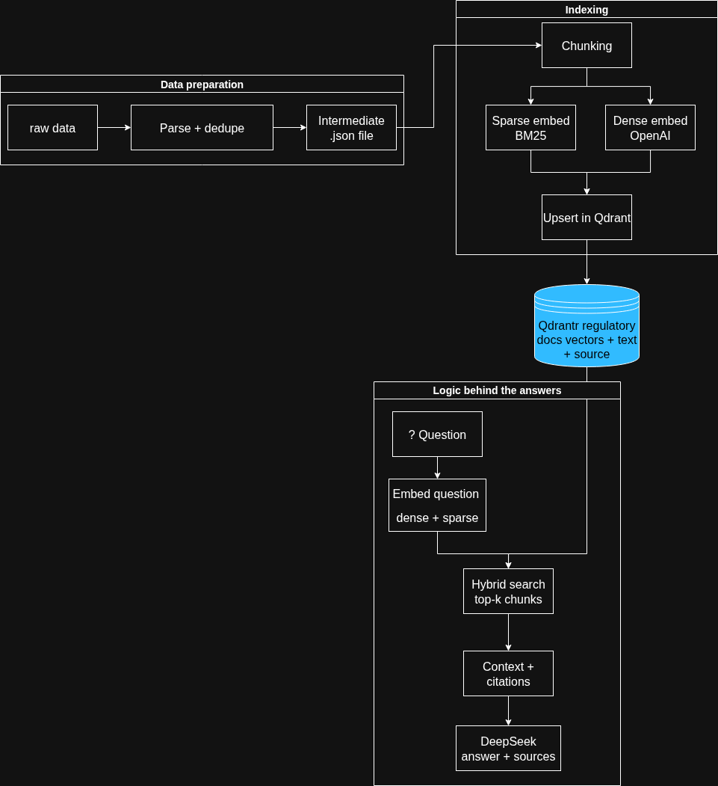

# Regulatory Compliance Assistant for Banking

A **portfolio / demo RAG** for **regulatory PDFs and HTML** (PCI DSS, Basel III, and similar corpora). It ingests documents, indexes them into **Qdrant**, and answers compliance-style questions with **source citations** — hybrid retrieval (dense + sparse), cross-encoder rerank, and grounded generation.

**Not** an enterprise compliance platform, legal product, or air-gapped system. Every question-and-answer path needs **live API access** (OpenAI embeddings + DeepSeek generation). Indexing also calls OpenAI for dense embeddings.

Built to show **traceable, cited RAG** over regulatory text — not a generic chatbot.

---

## Highlights

- **End-to-end pipeline** — ingest → chunk → embed → vector store → cited Q&A (CLI + HTTP API)
- **Robust PDF extraction** — fast path with automatic fallback to `pypdf` when needed
- **Hybrid retrieval** — OpenAI dense embeddings + BM25 sparse vectors, fused with **RRF** in Qdrant
- **Cross-encoder rerank** — fastembed re-scores top candidates before generation
- **Closed-book answers** — prompts constrain the model to retrieved context
- **RAGAS evaluation (dev)** — golden-set metrics; still uses OpenAI + DeepSeek APIs
- **Docker-ready** — API container + Qdrant via Compose; document indexing via CLI on the host

### What runs where

| Step | Runs | Needs network / APIs |
|------|------|----------------------|
| Ingest (parse PDF/HTML) | CLI, mostly local | Optional hi-res paths may pull models; core path is local files |
| Index (embed + upsert) | CLI | **OpenAI** embeddings; Qdrant |
| Ask (CLI, HTTP API, Web UI) | CLI or FastAPI | **OpenAI** (query embed) + **DeepSeek** (answer); Qdrant; rerank is local (fastembed) |
| RAGAS eval | CLI (dev) | Same as ask, plus judge LLM calls |
| Langfuse tracing | Optional | Langfuse host if enabled |

---

## Architecture


### Data flow



| Layer | Responsibility |
|-------|----------------|
| **Ingestion** | Load, validate, extract, dedupe headers/footers (`src/ingestion/`) |
| **Indexing** | Chunk, dense + sparse embed, upsert (`src/indexing/`) |
| **Retrieval** | Hybrid or dense search + optional cross-encoder rerank (`src/rag/retriever.py`) |
| **Generation** | Compliance prompts + DeepSeek (`src/rag/chain.py`) |
| **Orchestration** | `src/pipeline.py` — `run_ingestion`, `run_indexing`, `run_all` |

---

## Tech stack

| Component | Choice |
|-----------|--------|
| Runtime | Python 3.12, [uv](https://github.com/astral-sh/uv) |
| Embeddings | OpenAI `text-embedding-3-small` |
| LLM | DeepSeek `deepseek-chat` |
| Vector DB | Qdrant |
| Sparse / hybrid | [fastembed](https://github.com/qdrant/fastembed) BM25 + Qdrant RRF |
| API | FastAPI + Uvicorn |
| CLI | Typer |
| Eval (dev) | RAGAS |

---

## Quick start

### 1. Prerequisites

- Python 3.12+
- [uv](https://docs.astral.sh/uv/)
- Docker (for Qdrant and optional API container)
- Outbound network for **OpenAI** and **DeepSeek** (required for index + every Q&A)
- API keys: [OpenAI](https://platform.openai.com/) (embeddings), [DeepSeek](https://platform.deepseek.com/) (generation)

### 2. Install and configure

```bash
git clone <your-repo-url>
cd Regulatory-Compliance-Assistant-for-Banking

# Host: PDF/HTML ingestion + indexing (cannot be combined with observability in one venv)
uv sync --extra ingest

# API / local ask with Langfuse tracing (Docker image uses this extra)
uv sync --extra observability

cp .env.example .env
# Edit .env: OPENAI_API_KEY, DEEPSEEK_API_KEY, optional LANGFUSE_*
```

`ingest` and `observability` are separate optional extras because `unstructured` and `langfuse` conflict on `wrapt`. Use **ingest on the host** for `cli run`, **observability in the API container** (or a second venv) for tracing.

If ingest fails on `pi_heif`, ensure the `ingest` extra is installed (`uv sync --extra ingest`).

### 3. Start Qdrant

```bash
docker run -d --name qdrant -p 6333:6333 \
  -v qdrant_storage:/qdrant/storage \
  qdrant/qdrant
```

### 4. Add documents

Place regulatory PDFs or HTML under `data/raw/` (paths are configurable in `config.yaml`).

Sample corpora that work well: PCI DSS, Basel III / capital adequacy guidelines.

### 5. Index and ask

```bash
# Full pipeline: ingest + index (use --recreate when enabling hybrid or changing schema)
uv run python -m src.cli run --recreate

# Query the index
uv run python -m src.cli ask "What is cardholder data (CHD) under PCI DSS?"

# Sanity-check environment
uv run python -m src.cli doctor
```

---

## Example output

**Question:** What are PCI DSS requirements for cardholder data?

**Answer (abridged):** Requirements apply to entities that store, process, or transmit account data, including cardholder data (PAN, cardholder name, expiration date, service code). PCI DSS defines a minimum set of controls for protecting that data.

**Sources:**

```text
PCI-DSS-v4_0_1.pdf (p. 42)
PCI-DSS-v4_0_1.pdf (p. 18)
```

Every answer includes document and page citations so you can audit what the model saw.

---

## CLI reference

| Command | Description |
|---------|-------------|
| `uv run python -m src.cli run` | Ingest `data/raw` → chunk → embed → Qdrant |
| `uv run python -m src.cli run --recreate` | Drop and recreate the Qdrant collection |
| `uv run python -m src.cli run -q "..."` | Index, then answer one question |
| `uv run python -m src.cli ask "..."` | Query only (index must exist) |
| `uv run python -m src.cli doctor` | Check API keys and config |
| `uv run python -m src.cli eval-ragas` | RAGAS evaluation on golden set (dev; API-backed) |

Useful flags: `--raw-dir`, `--output-dir`, `--top-k`, `--source-filter`, `--skip-ingest`, `--skip-index`, `--json`.

---

## Hybrid retrieval

Hybrid search is **on by default** (`rag.hybrid_enabled: true` in `config.yaml`).

- **Dense** — semantic similarity (OpenAI embeddings)
- **Sparse** — lexical match for acronyms and exact terms (BM25 via fastembed)
- **Fusion** — Reciprocal Rank Fusion (RRF) inside Qdrant
- **Rerank** — cross-encoder (`rerank_enabled: true`) re-scores the top `rerank_top_n` candidates, returns final `top_k`
- **Rerank cutoff** — optional `rerank_min_score` drops weak chunks after reranking (tune per model; e.g. `0.35` for BGE)

After toggling hybrid, rerank, or changing vector schema, re-index:

```bash
uv run python -m src.cli run --recreate
```

To compare dense-only retrieval, set `hybrid_enabled: false` in `config.yaml` and re-run with `--recreate`.

To disable reranking, set `rerank_enabled: false`.

---

## Web UI

A banking-themed chat interface is served at the API root when Uvicorn is running.

```bash
uv run uvicorn src.api.main:app --reload --host 0.0.0.0 --port 8000
# Open http://127.0.0.1:8000
```

Features: suggested compliance questions, source citations, document scope filter (from indexed corpora), retrieval depth control, and live `/health` status.

Static assets live under `src/api/static/`.

---

## HTTP API

### Local

```bash
uv run uvicorn src.api.main:app --reload --host 0.0.0.0 --port 8000
```

**Health**

```bash
curl -s http://127.0.0.1:8000/health | python3 -m json.tool
```

**Ask**

```bash
curl -s -X POST http://127.0.0.1:8000/ask \
  -H "Content-Type: application/json" \
  -d '{"question": "What is capital adequacy under Basel III?"}'
```

Optional body fields: `top_k`, `source_filter`, `return_chunks`.

For containerized deployment, see [Docker](#docker).

---

## Docker

The **API** runs in Docker; **indexing** runs on the host via CLI. Vectors live in Qdrant (persistent volume), not in the app image.

```bash
cp .env.example .env   # QDRANT_URL=http://localhost:6333 for host CLI

docker compose up -d --build

# Index from host (localhost:6333 → published Qdrant port)
uv run python -m src.cli run

# API inside Compose uses QDRANT_URL=http://qdrant:6333 (set in docker-compose.yml)
curl -s http://localhost:8000/health
```

| Step | Where it runs | `QDRANT_URL` |
|------|----------------|--------------|
| `cli run` | Host | `http://localhost:6333` (`.env`) |
| `api` service | Container | `http://qdrant:6333` (Compose override) |

Rebuild the API image only when **application code** changes, not when you add new PDFs.

```bash
docker build -t regulatory-compliance-api .
docker compose logs -f api
docker compose down          # stop services
docker compose down -v       # also deletes Qdrant volume — requires re-index
```

`Dockerfile` — API-only image (uvicorn). `docker-compose.yml` — Qdrant + API services.

---

## Evaluation (RAGAS)

Measure retrieval and grounding quality on a small golden set (`data/eval/golden_questions.json`).

```bash
uv sync --group dev
uv run python -m src.cli eval-ragas
uv run python -m src.cli eval-ragas --json
```

| Role | Model |
|------|--------|
| RAG answers | Your pipeline (`chain.answer`) |
| RAGAS judge | DeepSeek |
| RAGAS embeddings | OpenAI |

**Metrics:** faithfulness, answer relevancy, context precision.

Latest local benchmark snapshot (34-question golden set):

```text
Overall:
- answer_relevancy: 0.7079
- context_precision: 0.5196
- faithfulness: 0.8652
```

Before/after retrieval tuning:

| Metric | Before | After |
|------|--------|-------|
| answer_relevancy | 0.7870 | 0.7079 |
| context_precision | 0.4565 | 0.5196 |
| faithfulness | 0.8908 | 0.8652 |

`eval-ragas` prints **overall**, **by topic** (pci / basel), and the **5 lowest context_precision** questions to guide retrieval tuning.

Requires a populated Qdrant index and both API keys. Evaluation calls external APIs and may take several minutes.

After changing `chunk_size` / hybrid / rerank settings, re-index before re-running eval:

```bash
uv run python -m src.cli run --recreate
uv run python -m src.cli eval-ragas
```

`src/eval/_ragas_compat.py` is a small import shim: recent `langchain-community` removed Vertex AI chat models that RAGAS still references at load time; the shim is dev-only and not used at runtime in production.

---

## Observability (Langfuse)

RAG queries are traced when the **observability** extra is installed and Langfuse keys are set.

| Span | What it captures |
|------|------------------|
| `rag_answer` | Full Q&A (tags: `api`, `cli`, or `eval`) |
| `qdrant_retrieve` | Hybrid/dense retrieval metadata |
| `cross_encoder_rerank` | Rerank scores and candidate count |
| LangChain callbacks | LLM generation + query embeddings |

```bash
uv sync --extra observability
# Set LANGFUSE_PUBLIC_KEY, LANGFUSE_SECRET_KEY, LANGFUSE_HOST in .env
uv run python -m src.cli ask "What is PCI DSS?"
```

The Docker API image installs `observability` by default. Host indexing uses `ingest` only — traces appear when you query via API or a venv with `observability`.

Set `LANGFUSE_ENABLED=false` to disable tracing without removing keys.

---

## Configuration

### `config.yaml`

| Section | Controls |
|---------|----------|
| `data` | Paths for raw files, processed JSON, logs |
| `ingestion` | PDF strategy, file types, dedupe, quality thresholds |
| `indexing` | Chunk size, embedding model, Qdrant collection, sparse model |
| `rag` | `top_k`, LLM settings, `hybrid_enabled`, `hybrid_prefetch_limit`, `rerank_enabled`, `rerank_top_n`, `rerank_min_score` |

### `.env`

| Variable | Purpose |
|----------|---------|
| `OPENAI_API_KEY` | Embeddings (index + retrieve + RAGAS) |
| `DEEPSEEK_API_KEY` | Answer generation + RAGAS judge |
| `DEEPSEEK_BASE_URL` | Optional; defaults to `config.yaml` |
| `QDRANT_URL` | Vector DB endpoint |
| `QDRANT_API_KEY` | Optional; Qdrant Cloud |
| `LANGFUSE_PUBLIC_KEY` | Langfuse tracing (observability extra) |
| `LANGFUSE_SECRET_KEY` | Langfuse tracing |
| `LANGFUSE_HOST` | Langfuse cloud or self-host URL |
| `LANGFUSE_ENABLED` | `true` / `false` |

---

## Project layout

```text
src/
  pipeline.py          # Orchestration: ingest → index → optional ask
  cli.py               # Typer entrypoint
  api/main.py          # FastAPI
  ingestion/           # Load, parse, robust PDF extraction
  indexing/            # Chunk, embed, sparse, Qdrant store
  rag/                 # Retrieve, prompts, chain
  eval/                # RAGAS evaluation (dev)
data/
  raw/                 # Your PDFs/HTML (gitignored contents)
  processed/           # parsed_document.json, quality reports
  eval/                # golden_questions.json
config.yaml
diagrams/              # Architecture diagrams (README)
diagrams_video/        # Demo screen recording (README)
Dockerfile             # API-only image
docker-compose.yml     # Qdrant + API
```

---

## Design notes

**Batch vs online serving.** Ingestion and indexing are **local batch jobs** (CLI): you run them when documents change. The **API and Web UI are online query services** — each `/ask` or `cli ask` calls external embedding and LLM APIs. Qdrant and reranking run on your infra; generation does not.

**Why hybrid?** Regulatory text is full of exact tokens (PCI DSS, CHD, PAN, article numbers). Dense search alone can miss them; BM25 + RRF improves recall on terminology-heavy questions.

**Scope and limits.** Demo/portfolio project: no auth on the API by default, no SLA, no certified compliance workflow. Useful for learning and interviews; not a substitute for legal or compliance review.

**Not legal advice.** This tool assists document Q&A with citations. It does not replace compliance review, legal counsel, or official interpretation of regulations.

---

## License

See [LICENSE](LICENSE).

---

## Demo

Screen recording of the assistant in action: compliance question → hybrid retrieval → grounded answer with page citations.

[diagrams_video/demo.mp4](diagrams_video/demo.mp4)
